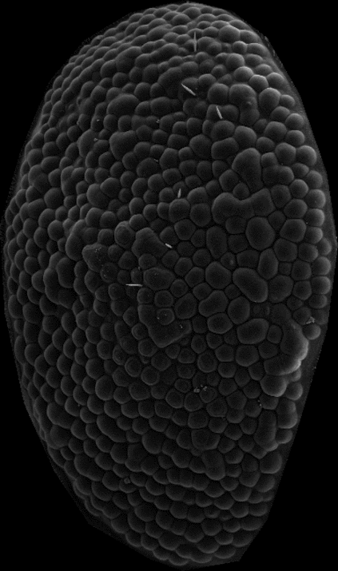

QED
===

**Quantitative Evaluation of Distortion**

QED is a Matlab-based package for Windows that is aimed at extracting and analysing structural information from scanning electron microscopy images for comparison between a group of interest and a control group. Oriented primarily for analysis of the Drosophila eye, it uses edge detection and boundary walking to generate distributions of ommatidial roundness, with calculations for spatial distributions ( angles and distances between ommatidia ) also implemented. 

For stand-alone installation on Windows systems, you can download the installer here :
http://www.quentincaudron.com/qed/QED_Installer_Windows.exe

Documentation is included as a PDF.

